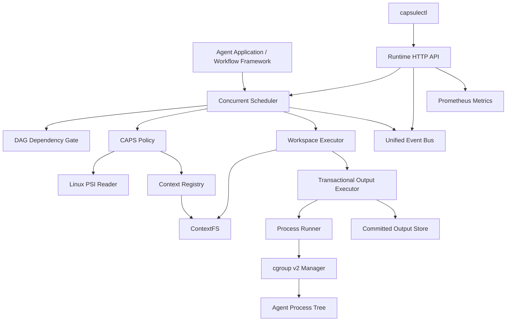

# CAPSuleRT

> 面向单机多 Agent 系统的 Linux 用户态运行时  
> **压力感知调度、资源隔离、上下文复用、事务输出与可验证依赖执行**

CAPSuleRT 将 Agent 视为系统级执行实体，统一管理其生命周期、资源预算、上下文数据、任务依赖、进程执行、结果提交和运行状态。

项目运行在 Agent 应用与 Linux 操作系统之间。上层框架仍可使用 DAG、Graph 或其他方式描述业务流程；CAPSuleRT 负责将任务安全、稳定地落到本地进程和内核资源上。

```text
Agent Application / Workflow Framework
                  │
                  ▼
              CAPSuleRT
                  │
      ┌───────────┼───────────┐
      ▼           ▼           ▼
  cgroup v2      PSI      Local Filesystem
```

当前版本面向 **openEuler/Linux 单机环境**，核心能力包括：

- CAPS 上下文亲和与系统压力感知调度；
- cgroup v2 Agent 级资源限制和故障隔离；
- ContextFS 内容寻址存储与物理去重；
- 独立 Agent 工作区和 Copy-on-Write 物化；
- 事务化输出提交与 SHA-256 完整性验证；
- DAG 依赖门控和失败传播；
- 统一事件流、HTTP 查询 API、Prometheus 指标和 CLI。

---

## 名称含义

**CAPSuleRT** 由两部分组成：

- **CAPS**：Context-Affinity and Pressure-aware Scheduling；
- **Capsule**：每个 Agent 都在受控的资源、工作区和输出边界内执行；
- **RT**：Runtime。

该名称对应项目的核心目标：在系统压力和上下文复用之间进行调度，同时为每个 Agent 提供独立、可验证的执行舱。

---

## 项目定位

CAPSuleRT 解决的是多 Agent 执行过程中的系统问题，而不是替代业务编排框架。

| 层级 | 关注内容 |
|---|---|
| Agent 应用 | Prompt、模型、工具、业务角色 |
| 工作流框架 | Graph、Chain、DAG、消息流 |
| CAPSuleRT | 调度、资源、上下文、进程、输出、故障和观测 |
| Linux | cgroup v2、PSI、进程和文件系统 |

CAPSuleRT 不限定 Agent 的实现方式。当前 Worker 以本地进程为执行单元，可运行 Python、Go 或其他可执行程序。

---

## 核心能力

### Agent Control Block

每个 Agent 由 Agent Control Block（ACB）描述。ACB 贯穿提交、调度、执行和结果发布全过程，保存：

- Agent ID、角色、命令和参数；
- 生命周期与调度状态；
- CPU、内存和 PID 资源预算；
- Context 引用与工作区信息；
- DAG 依赖和上游输出；
- cgroup 路径与资源统计；
- 输出事务、提交路径和验证状态；
- 退出码、错误和完成时间。

执行生命周期：

```text
CREATED → READY → RUNNING → COMPLETED
                         └→ FAILED
```

调度状态：

```text
QUEUED → RUNNING → SUCCEEDED
                 ├→ FAILED
                 └→ BLOCKED
```

---

### cgroup v2 资源隔离

CAPSuleRT 为每个 Agent 创建独立 cgroup，可配置：

- CPU quota；
- `memory.max`；
- `memory.swap.max`；
- `pids.max`。

Runtime 会收集：

- CPU 使用量；
- 当前和峰值内存；
- Swap 使用量；
- OOM Kill 次数；
- cgroup 路径和执行结果。

Agent 超时或失败时，Runtime 使用 `cgroup.kill` 清理整个进程树，避免只终止父进程后遗留子进程。

```text
Agent cgroup
├── main process
├── child process
└── grandchild process
```

因此，每个 Agent 都是独立的资源与故障域。

---

### CAPS 调度策略

CAPS 是 CAPSuleRT 的核心调度策略。它综合考虑：

- Linux PSI CPU 压力；
- Linux PSI Memory 压力；
- Linux PSI I/O 压力；
- Agent 的资源需求；
- 上下文请求量；
- 可复用上下文字节数；
- Context Affinity；
- Agent 等待时间。

简化后的评分形式：

```text
score =
    pressure penalty
  - context affinity benefit
  - waiting age bonus
```

CAPS 的目标不是单纯追求最早提交优先，而是在当前机器状态下选择综合执行成本更低的 Ready Agent。

项目同时保留 FIFO Policy，便于进行行为对照和回归测试。

---

### ContextFS

ContextFS 是 CAPSuleRT 的内容寻址上下文存储。

```text
Logical Reference
        │
        ▼
  SHA-256 Digest
        │
        ▼
   Immutable Blob
```

主要能力：

- SHA-256 内容寻址；
- 相同内容物理去重；
- 逻辑引用绑定；
- 原子 Blob 发布；
- 元数据持久化；
- 引用统计；
- 垃圾回收；
- 并发相同内容写入处理。

目录结构：

```text
contextfs/
├── blobs/
│   └── sha256/
├── metadata/
│   └── sha256/
├── refs/
└── tmp/
```

不同逻辑名称只要解析到相同 Digest，就会共享同一个物理对象，并在 CAPS 调度中获得相同的上下文亲和收益。

---

### Agent 工作区

ContextFS 中的不可变对象不会直接交给 Agent 修改。Runtime 会为每个 Agent 创建独立工作区：

```text
workspace/
├── inputs/        # 只读输入
├── private/       # Agent 私有可写区域
└── manifest.json
```

物化过程：

1. 验证 Context 引用；
2. 在临时目录中准备工作区；
3. 优先使用 `FICLONE` reflink；
4. 不支持 reflink 时退化为普通复制；
5. 输入文件设置为只读；
6. 通过原子 rename 发布完整工作区。

该机制保证：

- Agent 修改不会污染共享 Context Blob；
- 不同 Agent 之间互不影响；
- 失败工作区可按策略保留；
- 成功工作区可自动清理。

---

### 事务化输出

Agent 不直接写入最终结果目录，而是写入独立 staging：

```text
Agent Process
      │
      ▼
Private Staging
      │
      ├── Process Failed      → Discard / Retain
      ├── Validation Failed   → Discard / Retain
      └── Validation Passed
                 │
                 ▼
            Atomic Rename
                 │
                 ▼
          Committed Output
```

提交前会检查：

- 路径合法性；
- 文件数量；
- 总字节数；
- 文件类型；
- 符号链接；
- 特殊文件；
- 文件权限；
- SHA-256 Digest。

提交成功后生成：

```text
.aegis-commit.json
```

Manifest 记录：

- Agent ID；
- Transaction ID；
- 提交时间；
- 文件列表；
- 文件大小；
- 文件权限；
- 每个文件的 SHA-256；
- 总文件数和总字节数。

最终结果目录通过同一文件系统上的原子 rename 发布，避免下游观察到半成品。

---

### 输出完整性验证

进程退出码为零并不代表任务结果已经可信。

CAPSuleRT 将任务成功定义为：

```text
Process Succeeded
        +
Output Committed
        +
Manifest Verified
        +
Artifact SHA-256 Verified
```

在下游消费结果前，Runtime 会重新验证：

- Commit Path 和 Manifest Path；
- Agent ID 和 Transaction ID；
- 文件数量和大小；
- 文件权限；
- 每个 Artifact 的 SHA-256；
- 是否存在额外文件；
- 是否存在符号链接；
- 路径是否逃逸 Agent 命名空间。

验证成功后：

```text
OutputVerified = true
VerificationMethod = "sha256-manifest"
```

---

### DAG 依赖与失败传播

任务可以声明上游依赖：

```go
scheduler.Job{
    Agent: agentControlBlock,
    DependsOn: []string{
        "producer-agent",
    },
}
```

下游 Agent 只有在所有上游任务满足以下条件后才会进入调度候选集合：

```text
Phase == SUCCEEDED
OutputCommitted == true
OutputVerified == true
```

故障传播规则：

```text
Upstream FAILED
       │
       ▼
Downstream BLOCKED
       │
       ▼
Deeper Dependents BLOCKED
```

BLOCKED Agent 不会创建：

- 本地进程；
- cgroup；
-工作区；
- 输出事务。

---

### 统一事件流

CAPSuleRT 将运行时关键行为转换为统一事件：

```text
runtime.agent.submitted
runtime.pressure.sampled
runtime.agent.dispatched
runtime.agent.blocked
runtime.output.committed
runtime.output.verified
runtime.output.verification_failed
runtime.agent.finished
```

每个事件包含：

- 全局连续 Sequence；
- 唯一 Event ID；
- UTC 时间戳；
- Event Kind；
- Agent ID；
- Agent Phase；
- JSON Payload。

事件通过异步总线写入：

- 有界内存事件存储；
- JSONL 持久化日志。

Runtime API 和 CLI 均以统一事件模型为查询基础。

---

## 系统架构



完整执行路径：

```text
Submit Job
    │
    ▼
Resolve Context References
    │
    ▼
Check DAG Dependencies
    │
    ▼
Sample Linux PSI
    │
    ▼
CAPS Selects a Ready Agent
    │
    ▼
Prepare Isolated Workspace
    │
    ▼
Begin Output Transaction
    │
    ▼
Create and Attach cgroup
    │
    ▼
Run Agent Process Tree
    │
    ▼
Validate and Commit Output
    │
    ▼
Verify Manifest and SHA-256
    │
    ▼
Publish Events and Unblock Dependents
```

### Agentic Execution Loop

CAPSuleRT 在现有执行面之上提供了一个轻量认知面。新增层只负责理解和适配，不替代原有 Runtime：

```text
User natural-language goal
          │
          ▼
OpenAI-compatible LLM Client
          │
          ▼
Initial Planner ── strict JSON + Registry schema + DAG validation
          │
          ▼
Agent Orchestrator ── Plan Task → scheduler.Job / agent.ACB
          │
          ▼
Existing CAPSuleRT Scheduler / Runtime
          │
          ▼
Bounded Observation ── verified result.json + selected Runtime metadata
          │
          ▼
Decision ── GOAL_COMPLETED / CONTINUE / REPLAN / FAILED
          │
          ├── completed → verified final result
          └── replan ── preserve successful tasks, submit only new IDs
                              │
                              └────→ Existing CAPSuleRT Scheduler
```

Planner 的提示词直接来自 Capability Registry，不包含写死的工具表。Registry 的轻量 schema 会在 LLM Plan 进入 DAG 前和 Job 构建时各校验一次。Orchestrator 只提交验证后的新节点；真正的 Ready 判定、并发选择、生命周期、失败传播和资源治理仍由 Scheduler 与 Runtime 完成。Re-plan 在同一个 Scheduler 会话中引用已经 `SUCCEEDED` 且输出验证通过的任务记录，不重新执行它们。上游结果仍通过现有的 `AEGIS_DEPENDENCY_OUTPUTS_JSON` 机制交给下游 Agent。

当前内置 Capability：

| Capability | 用途 | 安全边界 |
|---|---|---|
| `filesystem.list` | 列出目录中的直接子项 | 只读、配置根目录内 |
| `filesystem.stat` | 观察路径是否存在及其类型、大小 | 只读、配置根目录内；缺失是有效 Observation |
| `file.inspect` | 读取文本文件元数据与有界预览 | 只读、路径防逃逸、ContextFS |
| `data.inspect` | 分析 CSV / JSON 的行、字段、类型、缺失值和基础统计 | 只读、路径防逃逸、ContextFS |
| `text.analyze` | 分析已验证的上游结构化或文本输出 | 只读取已验证依赖输出 |
| `text.summarize` | 汇总已验证的分析结果 | 只读取已验证依赖输出 |

它们由 `worker/python/cognitive_agent.py` 作为普通 Worker 进程执行；LLM 不直接访问 shell、文件系统或 Worker。Agent Loop 默认最多 Re-plan 3 次，并同时受上下文取消、总超时、单任务超时、严格 Decision 解码和等价 Plan 检测约束。Observation 只包含有界的结构化结果、摘要、退出信息与选定 Runtime 元数据，不复制原始日志。

三个完全离线的确定性演示：

```bash
# 正常执行，无需 Re-plan
capsulectl agent run \
  --mock --mock-scenario normal \
  --input examples/sales.txt \
  --task "分析 examples/sales.txt 并生成总结"

# 初始假设 sales.csv，观察真实目录后改用 sales.json
capsulectl agent run \
  --mock --mock-scenario replan --max-replans 3 \
  --task "检查 examples/workspace 中的数据文件，找到其中可分析的数据，分析主要内容并生成总结。"

# 持续找不到输入，在 MaxReplans 后安全失败（预期非零退出）
capsulectl agent run \
  --mock --mock-scenario failure --max-replans 3 \
  --task "分析一个不存在且无法发现的数据文件"
```

认知事件写入同一条 telemetry 总线：`cognitive.plan.created`、`cognitive.observation.created`、`cognitive.decision.made`、`cognitive.replan.requested`、`cognitive.plan.revised`、`cognitive.goal.completed` 和 `cognitive.loop.aborted`。任务开始、完成和失败继续使用 Scheduler 原有的 `runtime.agent.*` 事件，其 Record metadata 带有 run ID、iteration 与 capability 关联信息。

### Autonomous Experiment Agent

比赛实验 Demo 是与 Research Agent 相互独立的 CPU-only 垂直切片。Goal 可以在 CLI 或 Dashboard 中编辑，`experiment_directory` 则指定配置根目录内的 workspace-relative 实验目录。默认 cognitive response 仍来自经过生产 Planner/Decision 严格 JSON 入口和 Capability Registry 校验的离线确定性 fixture，以保证演示可复现；可执行配置不从自然语言中自由生成，而是由该目录中的受限 Manifest 决定。目录发现、数据集准备、三种方法实验、结果分析和报告均由真实本地 Worker 进程执行，不是 Mock 输出。

```text
Editable Goal + workspace-relative experiment_directory
                         ↓
Plan v1: experiment.manifest.inspect
                         ↓
     bounded directory + validated Manifest Observation
                         ↓ REPLAN
Plan v2: reuse Manifest inspection → prepare configured CSV
                         ├─ Logistic Regression ─┐
                         ├─ Random Forest ───────┼─→ analyze → report
                         └─ SVM ─────────────────┘
                         ↓ (only if a configured run exceeds its budget)
            structured failure Observation → REPLAN
                         ↓
Plan v3: reuse Manifest / Dataset / successful methods
                         ↓
            bounded retry → analysis → experiment_report.md
```

五个注册能力分别是 `experiment.manifest.inspect`、`experiment.dataset.prepare`、`experiment.run`、`experiment.analyze` 和 `experiment.report`。Plan v1 只通过 Scheduler 运行 Manifest 检查 Worker；它实际列出目录并将验证后的数据集、方法参数、Manifest SHA-256 和有界目录元数据作为 Observation 返回。Plan v2 复用该输出并执行配置声明的实验。仓库示例把 Random Forest 配置为 1000 棵树，因此会稳定触发 64 MiB 预算拒绝；Worker 以非零状态退出，Scheduler 记录 `FAILED`，受限 failure artifact 被投影成结构化 Observation。随后可选的 Plan v3 保留 Manifest、数据集、Logistic Regression 和 SVM 的已验证输出，只使用新任务 ID 将 Random Forest 调整为 100 棵树并重试。如果 Manifest 一开始就是资源预算内的配置，则 Plan v2 可以直接完成，不会为了展示而伪造 Plan v3。

实验目录必须包含名为 `capsule-experiment.json` 的声明式配置，当前 schema 为：

```json
{
  "version": 1,
  "dataset": "classification.csv",
  "methods": [
    {"method": "logistic_regression"},
    {"method": "random_forest", "n_estimators": 1000},
    {"method": "svm"}
  ]
}
```

Manifest 使用严格解码，未知字段、额外 JSON、非 `version: 1`、重复或未注册方法都会被拒绝；它必须恰好声明 Logistic Regression、Random Forest 和 SVM，且 `n_estimators` 只允许用于 Random Forest，范围为 1–1000。`experiment_directory` 和 Dataset 都必须是配置 workspace root 内的规范化相对路径；绝对路径、`..`、目录/Manifest/Dataset 符号链接逃逸以及非 CSV Dataset 会被拒绝。Manifest、目录项和 Dataset 分别受 32 KiB、128 项和 8 MiB 硬限制。Manifest 不能声明 shell、脚本、可执行文件、模块或环境变量，LLM 也不能绕过这五个注册能力执行工具。

需要明确区分演示数据与真实执行：当前准确率固定为 0.86 / 0.91 / 0.88，working-set 数值也是确定性场景 estimate；它们不声称是用户数据上的真实机器学习训练 benchmark。每次运行的新 Worker 进程、确定性 CPU 工作与计时、CAPSuleRT Scheduler 生命周期、资源失败、Observation、Re-plan、任务复用、Output Transaction 和报告验证都是真实现场执行。

```bash
make build
./bin/capsulectl experiment demo \
  --workspace-root . \
  --experiment-dir examples/experiment \
  --task "读取实验目录中的配置，比较三种方法并在资源失败后自主恢复"
# 或：make experiment-demo

# Dashboard 中选择 Autonomous Experiment Demo，编辑 Goal 和相对实验目录，然后点击“全新执行实验”
./bin/capsulectl dashboard --mock
```

产物默认位于 `var/experiment-demo/`：`experiment_report.md`、`experiment-summary.json`、事务化 Worker outputs、`runtime-events.jsonl` 和 `agent-events.jsonl`。实验不使用 CUDA、GPU、PyTorch、TensorFlow、网络或外部 API。CLI 默认保持快速执行，可用 `--work-scale` 增加真实确定性 CPU 计算量；Dashboard 默认使用较高倍率，让目录发现、Scheduler、Observation、重规划和可选重试在约数秒内可见，但不会用 `sleep` 伪造进度。

### 自主科研智能体

科研应用是 Agentic Execution Loop 上的第一条垂直能力链，并没有引入第二套调度器：

```text
Research Goal
    ↓
literature.search → paper.fetch → paper.parse → paper.analyze
    ↓                                      ↓
Environment Observation ← CAPSuleRT ← verified Evidence
    ↓
Decision / bounded query Re-plan
    ↓
research.synthesize → experiment.design → research.report
```

`literature.search` 通过 `LiteratureProvider` 归一化外部数据。真实模式聚合公开的 [arXiv Atom API](https://info.arxiv.org/help/api/user-manual.html) 与 [Crossref REST API](https://www.crossref.org/documentation/retrieve-metadata/rest-api/)，再按 DOI、arXiv ID、规范化 title + year 依次去重；合并时只补充空字段并保留 `metadata_sources`，不会用后到来源无条件覆盖。查询结果使用本地原子文件 TTL cache，`--no-cache` 可显式禁用。离线实现使用相同接口和仓库内 fixture。后续能力只读取归一化论文元数据及已验证的依赖产物，不读取 provider 原始响应。

| Capability | 输出 | 关键边界 |
|---|---|---|
| `literature.search` | 查询历史、论文元数据与全文可用性 | 查询/年份/数量校验，provider 超时 |
| `paper.fetch` | 公开正文 artifact 或结构化不可用原因 | 仅搜索结果中的 arXiv HTTPS URL、host allowlist、用户选择的单篇 PDF 预算（默认 CLI 20 MiB、硬上限 64 MiB）、PDF 类型与签名 |
| `paper.parse` | pages、稳定 section ID/page/range、abstract、references | pypdf 优先、Go fallback；20 MiB、64 pages、200,000 字符、32 sections |
| `paper.analyze` | structured reading、Candidate Finding、Verified Finding | basic/LLM 双模式；最多 8 sections、60 KiB prompt、32 findings，单论文单次分析调用 |
| `research.synthesize` | 跨论文 FACT / INFERENCE、方法比较与限制 | 至少两篇可用论文；引用闭包校验 |
| `experiment.design` | hypothesis、baseline、dataset、metric、ablation、protocol、risk | 所有建议显式标记为 PROPOSAL |
| `research.report` | 引用校验后的 `report.md` | 引用只能来自检索元数据，unsupported claim 必须为零 |

离线运行三个确定性研究场景：

```bash
# 正常检索、分析与报告
./bin/capsulectl agent research \
  --mock --mock-scenario normal \
  --task "调研 referring expression counting 的主要研究路线，并提出实验方案"

# 首轮只有一篇论文；认知层扩展查询并复用已完成搜索
./bin/capsulectl agent research \
  --mock --mock-scenario search-replan --max-search-rounds 3 \
  --task "调研 referring expression counting；证据不足时调整检索策略"

# 首篇全文不可访问；保留观察并改用公开替代论文
./bin/capsulectl agent research \
  --mock --mock-scenario unavailable \
  --task "调研 referring expression counting；不可访问时寻找公开替代论文"
```

默认产物位于 `var/research-agent/`：`report.md`、事务输出、ContextFS/工作区、query cache、Runtime telemetry 与 Agent 日志。可用 `--root`、`--report`、`--provider multi|arxiv|crossref`、`--max-replans`、`--max-search-rounds`、`--max-papers`、`--max-pdf-mb`、`--cache-ttl`、`--no-cache`、`--task-timeout` 和 `--loop-timeout` 调整。真实模式继续使用 `CAPSULE_LLM_BASE_URL`、`CAPSULE_LLM_API_KEY`、`CAPSULE_LLM_MODEL`，普通运行的默认元数据 Provider 为 arXiv + Crossref；真实 smoke/eval 默认固定为 arXiv，以保证评测论文具备可验证的公开全文。Query/Plan Policy 会拒绝重复查询、超出搜索轮次或 paper/analysis call budget 的计划，并在计划进入 CAPSuleRT Scheduler 前校验 `search → fetch → parse → analyze → synthesize → experiment/report` 的直接语义依赖。

PDF 大小限制是执行平面的资源护栏，而不是内容判断：它限制网络读取、Worker 内存和 Parser 输入，防止异常或恶意大文件拖垮整轮任务。用户可以在 CLI 通过 `--max-pdf-mb`，或在 Dashboard 的 Run settings 中选择 20/32/48/64 MiB。超过本轮预算时，`paper.fetch` 不再只返回进程退出码，而会提交 `PDF_LIMIT_EXCEEDED`、`required_bytes`、`limit_bytes`、`retryable=false` 的结构化 Observation；Re-plan 必须保留元数据、禁止重复下载同一论文，并从其他搜索结果中选择替代分支。硬上限仍为 64 MiB，避免认知层取消执行安全边界。

#### 可靠解析与 Evidence Verification

`PaperParser` 有两条实现：`PythonPDFParser` 通过固定的 `python3 worker/python/paper_parser.py` 参数和 stdin 调用 [pypdf](https://pypdf.readthedocs.io/en/latest/user/extract-text.html)，不拼接 shell；`BasicGoParser` 保留为零依赖 fallback。pypdf 使用 BSD-3-Clause 许可证，作为可选小依赖单独固定版本：

```bash
make research-python-setup
# Equivalent dependency install inside the reproducible optional venv:
# .venv-research/bin/python -m pip install -r worker/python/requirements-research.txt
```

`.venv-research/` 不进入版本控制。CLI 自动优先使用其中的解释器，也可用 `--python` 或 `CAPSULE_RESEARCH_PYTHON` 显式指定。没有安装 pypdf 时，默认 `--paper-parser auto` 会记录首选 parser 错误并使用 Go fallback；`--paper-parser python` 则明确失败。每次解析都输出 parser、尝试链、页数、字符数、section 数、耗时、fallback、截断与 warning 诊断，并通过已有 research telemetry 事件发布。文本型 PDF 可被提取，扫描件仍需要后续 OCR 能力，本阶段不会假装识别成功。

解析结果只有一个规范模型 `PaperDocument`，包含 bounded pages、sections、标准/Unknown heading、page range，以及 document/section byte range。LLM 模式通过现有 OpenAI-compatible Client 读取选定 section，输出严格 JSON `CandidateFinding`；候选中的 paper ID、section ID 和 evidence text 均不可信。确定性 `EvidenceVerifier` 只允许 exact 或受控 whitespace normalization，在原 section 中重新定位 byte range，并从原文切片生成 canonical Evidence。

来源存在性和 claim support 分开记录：`VERIFIED_SOURCE` 只代表片段真实存在，`SUPPORTED` 才允许进入 FACT，`UNSUPPORTED` 不会被替换成另一段“相近”证据。默认 support checker 使用数值、比较限定词和高精度词项覆盖规则；`--claim-support llm` 可增加可选语义判断，但不能绕过确定性的来源/range 校验。最终 Markdown 生成后还会重新检查 citation、retrieved paper identity、reference metadata、FACT statement 和 Evidence 的闭包。

#### Research Eval

固定语料 `eval/research/tasks.json` 包含 10 个完全离线任务，覆盖单/多论文、dataset/metric、贡献、限制、趋势、搜索恢复、全文不可用恢复、unsupported claim 和 citation hallucination。运行：

```bash
./bin/capsulectl agent research-eval \
  --corpus eval/research/tasks.json \
  --output var/research-eval
```

输出 `eval-report.json`、`eval-report.md` 和同一 telemetry 体系的 `eval-events.jsonl`。报告明确标记为 `fixture`，统计执行成功率、恢复率、paper 数量、Candidate/Verified/Supported/Unsupported、Evidence verification、citation closure、FACT coverage、循环保护和 fixture gold precision/recall；Mock token usage 为 `null`，不会估算。

真实 LLM/Provider 评测只能显式运行，不进入 CI：

```bash
export CAPSULE_LLM_BASE_URL=https://api.example.com/v1
export CAPSULE_LLM_API_KEY=your-api-key
export CAPSULE_LLM_MODEL=your-model

./bin/capsulectl agent llm-check
./bin/capsulectl agent research-eval \
  --suite real-small \
  --provider arxiv \
  --output var/research-real-eval
```

也可以复制 `config/llm.local.example.json` 为 Git 已忽略的 `config/llm.local.json`，设置权限为 `0600` 后填写 key。程序使用严格 JSON、拒绝 symlink/宽松权限/未知字段，并允许非空环境变量覆盖文件值。DeepSeek 当前 OpenAI-compatible 配置示例为 `https://api.deepseek.com` 与 `deepseek-v4-pro`；所有认知请求显式使用 JSON Output，并分别限制最大输出 token。

真实配置必须同时设置显式 endpoint、credential 与 model，URL 不得内嵌 credential。`llm-check` 只发送一个最多 16 token 的结构化小请求；错误信息保留 HTTP status，但会移除配置的 API key。缺少配置时命令明确输出 `SKIPPED` 和不含真实 secret 的配置模板。真实分析只在兼容 API 返回 usage 时记录 input/output tokens，不进行估算。

`eval/research/real-small.json` 配置 5 个跨领域真实 Goal，每个限制 3–5 篇；`eval/research/gold-annotations.json` 是待人工填写的轻量 gold corpus。每篇已标论文要求 3–5 条 finding/evidence，只有 `reviewed=true` 的条目进入 reviewed evidence precision，gold 未完成时 recall 明确不可用。运行 real-small 会生成 `real-eval-review.md`，其中 Relevance、Correctness、Evidence Quality、Coverage 与 Experiment Usefulness 均由人工按 1–5 分填写，Agent 不给自己评分。比赛主 Goal 位于 `examples/research/rec-goal.txt`，未写入核心逻辑。

真实 Research Run 的硬预算包括 `--max-papers`、`--max-llm-calls`、`--max-analysis-calls-per-paper`、`--max-replans`、`--loop-timeout` 和 `--max-context-bytes`。每个 run root 都落盘 `run-summary.json` 与 `failure-cases.json`；前者汇总 planning/search/parser/LLM/evidence/report/runtime，后者保留具体失败分类与有界原因。默认的一次 section selection 仍是 60 KiB 上限；Stage 5 先测量 truncation 与 evidence quality，不先引入 MapReduce/RAG。

真实公网 smoke test 必须人工触发，不属于 `go test ./...` 或默认 CI：

```bash
make research-python-setup
make research-smoke
```

它依次验证真实 arXiv metadata、真实 PDF、安全的 pypdf adapter、LLM connectivity、单篇 LLM analysis/evidence verification 和完整 Scheduler Research Loop。没有 LLM credentials 时，Provider/PDF/parser 仍会真实执行，后三项准确标记 `SKIPPED`，不会回退到 mock。新增研究事件继续进入原 telemetry bus：`research.paper.parsed`、`research.paper.analysis.*`、`research.candidate_finding.created`、`research.evidence.*`、`research.claim.*`、`research.report.validation.*`、`research.eval.completed`。

---

## 项目结构

```text
.
├── cmd/
│   ├── aegisd/                 # Runtime daemon 源码入口
│   ├── aegisctl/               # CLI 源码入口
│   ├── apidemo/                # Runtime API 综合演示
│   ├── eventdemo/              # 统一事件流演示
│   ├── integritydagdemo/       # DAG 与完整性验证演示
│   ├── transactiondemo/        # 事务输出演示
│   ├── workspaceexecdemo/      # 工作区执行演示
│   ├── contextbridgedemo/      # ContextFS 与调度器集成演示
│   ├── contextfsdemo/          # ContextFS 演示
│   ├── affinitydemo/           # 上下文亲和调度演示
│   ├── capsdemo/               # CAPS 与 FIFO 调度演示
│   ├── schedulerdemo/          # 并发调度演示
│   ├── cgroupdemo/             # cgroup 资源隔离演示
│   └── psidemo/                # PSI 读取演示
│
├── internal/
│   ├── agent/                  # Agent Control Block
│   ├── llm/                    # OpenAI-compatible LLM Client
│   ├── planner/                # 严格 JSON Plan 与 DAG 校验
│   ├── orchestrator/           # Plan 到现有 Scheduler/Runtime 的适配
│   ├── scheduler/              # Scheduler、Policy、DAG
│   ├── runtime/                # Runner 与执行器组合
│   ├── resource/               # cgroup v2 管理
│   ├── pressure/               # PSI 读取
│   ├── contextfs/              # 内容寻址存储与工作区
│   ├── contextstore/           # Context 解析和热度注册
│   ├── outputtxn/              # 事务输出与完整性验证
│   ├── telemetry/              # 统一事件总线
│   ├── controlapi/             # HTTP API 与 Prometheus
│   └── controlclient/          # CLI HTTP Client
│
├── worker/
│   └── python/                 # 示例 Agent 和故障注入程序
│
├── deploy/
│   └── systemd/                # systemd 部署与演示单元
│
├── Makefile
├── go.mod
└── README.md
```

---

## 运行环境

推荐环境：

| 组件 | 要求 |
|---|---|
| 操作系统 | openEuler 24.03 LTS SP4 或兼容 Linux |
| Linux Kernel | 6.6 或更高 |
| Go | 1.23 或更高 |
| Python | 3.9 或更高 |
| cgroup | cgroup v2 |
| PSI | CPU、Memory、I/O PSI |
| Service Manager | systemd |

无 cgroup 模式可用于本地功能验证；完整资源隔离需要 cgroup v2 和 systemd delegation。

---

## 快速开始

### 1. 检查环境

```bash
go version
python3 --version
```

检查 cgroup v2：

```bash
stat -fc %T /sys/fs/cgroup
```

预期输出：

```text
cgroup2fs
```

检查 PSI：

```bash
cat /proc/pressure/cpu
cat /proc/pressure/memory
cat /proc/pressure/io
```

---

### 2. 构建

```bash
mkdir -p bin

go build \
  -o bin/capsulertd \
  ./cmd/aegisd

go build \
  -o bin/capsulectl \
  ./cmd/aegisctl

go build \
  -o bin/apidemo \
  ./cmd/apidemo
```

构建全部命令：

```bash
go build ./cmd/...
```

`make build` 会构建 `bin/capsulertd` 和 `bin/capsulectl`。源码目录 `cmd/aegisd`、`cmd/aegisctl` 保留为历史兼容入口名称。

---

### 3. 运行测试

```bash
gofmt -w internal cmd
go test ./...
go vet ./...
```

发布前完整检查：

```bash
go test -race ./...
python3 -m py_compile worker/python/*.py
```

---

### 4. 启动本地 Runtime API

无 cgroup 模式：

```bash
./bin/apidemo \
  -disable-cgroup \
  -listen 127.0.0.1:18080
```

Runtime 默认仅监听 Loopback，不直接暴露到外部网络。

---

### 5. 查询 Runtime

另开终端：

```bash
./bin/capsulectl health
./bin/capsulectl ready
./bin/capsulectl status
./bin/capsulectl agents
./bin/capsulectl events
./bin/capsulectl metrics
```

---

## cgroup v2 配置

查看当前控制器：

```bash
cat /sys/fs/cgroup/cgroup.controllers
```

至少应包含：

```text
cpu memory pids
```

内核启动参数可通过以下命令检查：

```bash
cat /proc/cmdline
```

目标环境需要启用：

```text
cgroup_no_v1=all psi=1
```

systemd 服务需要委派相应控制器：

```ini
[Service]
Delegate=cpu memory pids
CPUAccounting=yes
MemoryAccounting=yes
TasksAccounting=yes
```

仓库 `deploy/systemd/` 中包含各模块演示单元。部署前需要根据实际环境调整：

- `User`；
- `Group`；
- `WorkingDirectory`；
- `ExecStart`；
- 二进制安装路径。

---

## 运行演示

### PSI 读取

```bash
go run ./cmd/psidemo
```

### 并发 Scheduler

```bash
go run ./cmd/schedulerdemo
```

### CAPS 调度

```bash
go run ./cmd/capsdemo
```

### Context Affinity

```bash
go run ./cmd/affinitydemo
```

### ContextFS

```bash
go run ./cmd/contextfsdemo
```

### ContextFS 与 Scheduler 集成

```bash
go run ./cmd/contextbridgedemo -disable-cgroup
```

### 隔离工作区

```bash
go run ./cmd/workspaceexecdemo -disable-cgroup
```

### 事务输出

```bash
go run ./cmd/transactiondemo -disable-cgroup
```

### DAG 与输出完整性

```bash
go run ./cmd/integritydagdemo -disable-cgroup
```

### 统一事件流

```bash
go run ./cmd/eventdemo -disable-cgroup
```

### HTTP API 综合演示

```bash
go run ./cmd/apidemo \
  -disable-cgroup \
  -listen 127.0.0.1:18080
```

---

## Runtime HTTP API

默认地址：

```text
http://127.0.0.1:18080
```

### 健康检查

```http
GET /healthz
```

### 就绪检查

```http
GET /readyz
```

以下状态会使 Runtime 返回不就绪：

- Scheduler 尚未启动；
- Scheduler 已停止；
- 等待队列已满；
- Event Sink 出现错误。

### Runtime 状态

```http
GET /v1/runtime/status
```

### Agent 列表

```http
GET /v1/agents
```

查询参数：

| 参数 | 说明 |
|---|---|
| `phase` | `QUEUED`、`RUNNING`、`SUCCEEDED`、`FAILED` 或 `BLOCKED` |
| `limit` | 最大返回数量 |

示例：

```bash
curl -sS \
  'http://127.0.0.1:18080/v1/agents?phase=FAILED&limit=100'
```

### 单个 Agent

```http
GET /v1/agents/{id}
```

### 事件查询

```http
GET /v1/events
```

查询参数：

| 参数 | 说明 |
|---|---|
| `since` | 返回 Sequence 大于该值的事件 |
| `limit` | 最大返回数量 |
| `kind` | Event Kind |
| `agent_id` | Agent ID |
| `phase` | Agent Phase |

示例：

```bash
curl -sS \
  'http://127.0.0.1:18080/v1/events?since=10&limit=100'
```

---

## capsulectl

安装：

```bash
sudo install \
  -o root \
  -g root \
  -m 0755 \
  bin/capsulectl \
  /usr/local/bin/capsulectl
```

常用命令：

```bash
capsulectl health
capsulectl ready
capsulectl status
capsulectl agents
capsulectl agents -phase FAILED
capsulectl agents -phase BLOCKED
capsulectl agent <agent-id>
capsulectl events -since 10
capsulectl watch
capsulectl metrics
```

### 自然语言 Agent 任务

无需外部 API 的完整离线演示（Mock 只替代 LLM 响应，其余 Planner、DAG、Runtime、Worker、OutputTxn 和 Telemetry 都会真实运行）：

```bash
./bin/capsulectl agent run \
  -mock \
  -task "读取 examples/sales.txt，分析其中的信息并生成总结"
```

也可显式指定 Mock 输入文件：

```bash
./bin/capsulectl agent run \
  -mock \
  -input examples/sales.txt \
  -task "分析销售数据并生成总结"
```

使用真实 OpenAI-compatible 服务：

```bash
export CAPSULE_LLM_BASE_URL=https://api.example.com/v1
export CAPSULE_LLM_API_KEY=your-api-key
export CAPSULE_LLM_MODEL=your-model

./bin/capsulectl agent run \
  -task "读取 examples/sales.txt，分析其中的信息并生成总结"
```

| 配置 | 说明 |
|---|---|
| `CAPSULE_LLM_BASE_URL` | 兼容服务的 API 根地址；客户端请求其 `/chat/completions`；为空时使用 OpenAI API 根地址 |
| `CAPSULE_LLM_API_KEY` | 可选 Bearer Token；不会写入日志 |
| `CAPSULE_LLM_MODEL` | 必填模型名 |

默认以无 cgroup 模式运行，适合本地开发；目标机器具备 systemd delegation 时可增加 `-enable-cgroup`。执行数据默认保存在 `var/cognitive-agent/`，包括 ContextFS、事务输出、Agent 日志和统一 Runtime 事件日志。

开发认知层时可单独运行：

```bash
go test ./internal/llm ./internal/planner ./internal/orchestrator
python3 -m py_compile worker/python/cognitive_agent.py
```

指定 Runtime 地址：

```bash
export CAPSULERT_SERVER=http://127.0.0.1:18080
capsulectl status
```

或者：

```bash
capsulectl \
  -server http://127.0.0.1:18080 \
  status
```

---

## Competition Dashboard

Dashboard 是一个本地 Go control layer 与内嵌静态页面。它通过 SSE 消费现有 telemetry，并读取已提交的 output transaction、run summary 和报告；任务仍由原有 Orchestrator 提交给 CAPSuleRT Scheduler。页面采用一条清晰的比赛叙事：Goal → 真实 Task DAG → CAPSuleRT 执行 → Observation → Decision / Re-plan → 验证结果。核心视图直接并排显示 DAG 与结构化决策，随后用四项运行时证据说明 Scheduler 并行、任务时间重叠、有效输出复用和验证关卡；完整 Telemetry、Scheduler 计数和 Research Evidence 收纳在可展开的 Technical evidence 中。所有数字均从当前 run 的 API 与 telemetry 动态计算，不使用写死的 Demo 指标。

首次打开 Dashboard 只显示任务启动器，不会自动把最近一次持久化结果冒充为新运行。历史任务必须由用户在 Recent runs 中明确选择，也可以使用 `/?run=<run-id>` 打开可分享的持久化运行；页面会用 `HISTORICAL SNAPSHOT` 与 `FRESH EXECUTION` 明确区分两者，并显示本次 Run ID。Autonomous Experiment 的 Goal 可以编辑，旁边的 `experiment_directory` 只接受服务端 workspace root 内的相对目录；点击“全新执行实验”会先清空旧结果，再创建新 Run、新 Worker 进程和新 output transaction。该模式会隐藏 PDF、Provider 和 Research Evidence 等无关设置，集中展示 Plan v1 目录/Manifest 发现、Plan v2 配置执行，以及资源失败时才出现的 Plan v3 复用与重试链。Worker 时间来自实际 CPU 段计时，固定准确率和 working-set estimate 会明确标成比赛场景夹具。

离线比赛演示：

```bash
make build
./bin/capsulectl dashboard --mock
# 可按机器性能调整可观察 CPU 工作量（范围 1..5000）
./bin/capsulectl dashboard --mock --experiment-work-scale 2000
```

浏览器打开 `http://127.0.0.1:8080`。默认只监听 loopback；可用 `--listen` 显式修改。页面中的 Mock / Real 标识不会隐藏。

真实模式默认使用本地 `config/llm.local.json`（权限必须为 `0600`）或 `CAPSULE_LLM_*` 环境变量，并使用现有 arXiv Provider 与 Python PDF parser：

```bash
./bin/capsulectl dashboard \
  --python .venv-research/bin/python
```

四个比赛 preset 来自 `examples/dashboard/presets.json`：LOCAL `Autonomous Experiment`、REAL `REC Research`、离线确定性 `Re-plan Demo` 和 `Evidence Guard`，可通过 `--preset-file` 替换。REAL 不可用时页面只会询问是否明确切换 MOCK，不会静默降级。Run settings 可在启动前选择单篇 PDF 下载/解析预算；语言选择支持中文和 English，并保存在浏览器本地偏好中。Dashboard 同一时间只允许一个 active run，最近 10 次运行从 `var/dashboard/runs/` 恢复；每个终态目录持久化 metadata、events、plan、papers、evidence、summary、failure cases 和 report。Cancel 会沿 context / interrupt 语义传入现有 Runtime，不使用 `kill -9`。

页面展示的 CPU / Memory 数值是 Scheduler 已有的 Linux PSI `some.avg10` 停顿压力百分比，不会冒充 CPU/RAM 利用率；页面也会明确显示当前运行是否真正启用了 cgroup 强隔离。Token usage 缺失时显示 `Unavailable`，Evidence rejected 不会被隐藏。引用闭环与回答完整度分开评估：`citation_closure=PASS` 只证明引用和 FACT 没有越过 Evidence 边界；确定性的 `ResearchQuality` 另行检查方法、数据集、指标、局限与实验可执行性，并显示 `READY / PARTIAL / INSUFFICIENT` 和缺口。报告预览使用阻止 raw HTML/script 的安全 Markdown renderer，下载仍返回真实 `report.md`。比赛演示讲稿见 `docs/demo-script.md`；`make dashboard-smoke` 运行三场 Research fixture 与一场本地真实 Experiment 恢复测试，`make dashboard-screenshot` 仅在检测到本地 Chromium/Chrome 时生成可选截图。

主要本地接口：

```text
POST /api/runs
GET  /api/runs
GET  /api/runs/:id
POST /api/runs/:id/cancel
GET  /api/runs/:id/events     (SSE)
GET  /api/runs/:id/plan
GET  /api/runs/:id/runtime
GET  /api/runs/:id/papers
GET  /api/runs/:id/evidence
GET  /api/runs/:id/report
```

---

## Prometheus 指标

接口：

```http
GET /metrics
```

主要指标：

| 指标 | 说明 |
|---|---|
| `capsulert_up` | HTTP Runtime 是否存活 |
| `capsulert_ready` | Runtime 是否就绪 |
| `capsulert_runtime_uptime_seconds` | Runtime 运行时间 |
| `capsulert_scheduler_started` | Scheduler 是否启动 |
| `capsulert_scheduler_stopped` | Scheduler 是否停止 |
| `capsulert_scheduler_workers` | Worker 数量 |
| `capsulert_scheduler_queue_depth` | 当前队列深度 |
| `capsulert_scheduler_queue_capacity` | 队列容量 |
| `capsulert_scheduler_agents{phase=...}` | 各 Phase 的 Agent 数量 |
| `capsulert_event_bus_published_total` | 已发布事件数 |
| `capsulert_event_bus_delivered_total` | 已投递事件数 |
| `capsulert_event_bus_sink_errors_total` | Event Sink 错误数 |
| `capsulert_event_bus_queue_depth` | 事件队列深度 |
| `capsulert_event_sequence` | 最新事件序列号 |

查询：

```bash
curl -sS http://127.0.0.1:18080/metrics
```

Prometheus 配置示例：

```yaml
scrape_configs:
  - job_name: capsulert
    static_configs:
      - targets:
          - 127.0.0.1:18080
```

---

## 设计约束

CAPSuleRT 当前实现遵循以下约束：

1. 每个 Agent 使用独立 cgroup；
2. Agent 超时后清理整个进程树；
3. ContextFS Blob 发布后不可变；
4. 相同内容只存储一个物理 Blob；
5. Agent 工作区与共享 Blob 隔离；
6. Agent 输出只能写入私有 staging；
7. 输出提交前拒绝符号链接和非普通文件；
8. 失败执行不会发布 committed 结果；
9. 下游只消费 committed 且 verified 的结果；
10. 输出完整性失败会阻断依赖任务；
11. BLOCKED Agent 不产生执行副作用；
12. HTTP 控制面只提供只读查询；
13. Runtime API 默认仅监听 Loopback；
14. 关键状态变化进入统一事件流。

---

## 项目边界

当前版本聚焦单机多 Agent 执行，尚未覆盖：

- 跨节点调度；
- 远程 Worker；
- GPU 和显存资源治理；
- 多租户身份与权限；
- Runtime 写操作 API；
- 生产级高可用控制面；
- vLLM Prefix Cache 或物理 KV Cache 接入；
- 生产级多用户 Dashboard 与远程部署；
- 大规模真实模型负载基准。

这些能力不影响当前单机 Runtime 的完整执行闭环。

---

## 验证范围

仓库中的测试和演示覆盖：

- Agent 生命周期；
- cgroup CPU、Memory 和 PID 限制；
- OOM 故障域；
- 子孙进程清理；
- 并发 Scheduler；
- FIFO 与 CAPS Policy；
- PSI 采样；
- Context Affinity；
- ContextFS 去重与 GC；
- ContextFS 真实引用桥接；
- 工作区隔离和物化；
- 事务输出提交；
- 输出篡改检测；
- DAG 依赖门控；
- 多层 BLOCKED 传播；
- 统一事件顺序；
- HTTP API；
- Prometheus 指标；
- CLI 查询。

完整回归命令：

```bash
gofmt -w internal cmd
go test ./...
go test -race ./...
go vet ./...
go build ./cmd/...
python3 -m py_compile worker/python/*.py
```

---

## 运行时闭环

CAPSuleRT 当前已经形成以下完整闭环：

```text
Agent Submission
    +
DAG Dependency Gate
    +
PSI and Context-aware Scheduling
    +
cgroup Fault Domain
    +
ContextFS Workspace
    +
Transactional Output
    +
SHA-256 Verification
    +
Failure Propagation
    +
Unified Observability
```

<p align="center">
  <strong>CAPSuleRT — Context-aware scheduling inside a verified Agent execution capsule.</strong>
</p>
