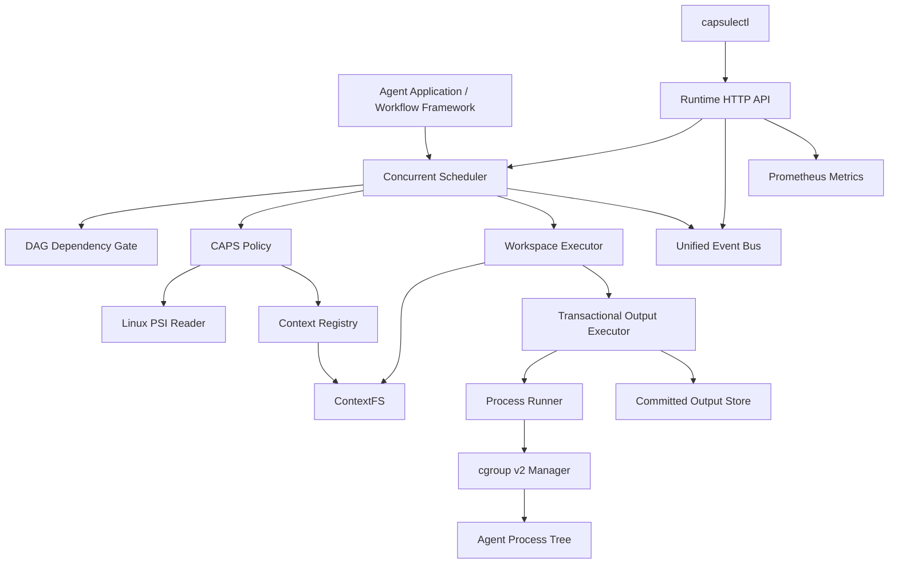

CAPSuleRT
> 面向单机多 Agent 系统的 Linux 用户态运行时  
> **压力感知调度、资源隔离、上下文复用、事务输出与可验证依赖执行**
CAPSuleRT 将 Agent 视为系统级执行实体，统一管理其生命周期、资源预算、上下文数据、任务依赖、进程执行、结果提交和运行状态。
项目运行在 Agent 应用与 Linux 操作系统之间。上层框架仍可使用 DAG、Graph 或其他方式描述业务流程；CAPSuleRT 负责将任务安全、稳定地落到本地进程和内核资源上。
```text
Agent Application / Workflow Framework
                  │
                  ▼
              CAPSuleRT
                  │
      ┌───────────┼───────────┐
      ▼           ▼           ▼
  cgroup v2      PSI      Local Filesystem
```
当前版本面向 openEuler/Linux 单机环境，核心能力包括：
CAPS 上下文亲和与系统压力感知调度；
cgroup v2 Agent 级资源限制和故障隔离；
ContextFS 内容寻址存储与物理去重；
独立 Agent 工作区和 Copy-on-Write 物化；
事务化输出提交与 SHA-256 完整性验证；
DAG 依赖门控和失败传播；
统一事件流、HTTP 查询 API、Prometheus 指标和 CLI。
---
名称含义
CAPSuleRT 由两部分组成：
CAPS：Context-Affinity and Pressure-aware Scheduling；
Capsule：每个 Agent 都在受控的资源、工作区和输出边界内执行；
RT：Runtime。
该名称对应项目的核心目标：在系统压力和上下文复用之间进行调度，同时为每个 Agent 提供独立、可验证的执行舱。
---
项目定位
CAPSuleRT 解决的是多 Agent 执行过程中的系统问题，而不是替代业务编排框架。
层级	关注内容
Agent 应用	Prompt、模型、工具、业务角色
工作流框架	Graph、Chain、DAG、消息流
CAPSuleRT	调度、资源、上下文、进程、输出、故障和观测
Linux	cgroup v2、PSI、进程和文件系统
CAPSuleRT 不限定 Agent 的实现方式。当前 Worker 以本地进程为执行单元，可运行 Python、Go 或其他可执行程序。
---
核心能力
Agent Control Block
每个 Agent 由 Agent Control Block（ACB）描述。ACB 贯穿提交、调度、执行和结果发布全过程，保存：
Agent ID、角色、命令和参数；
生命周期与调度状态；
CPU、内存和 PID 资源预算；
Context 引用与工作区信息；
DAG 依赖和上游输出；
cgroup 路径与资源统计；
输出事务、提交路径和验证状态；
退出码、错误和完成时间。
执行生命周期：
```text
CREATED → READY → RUNNING → COMPLETED
                         └→ FAILED
```
调度状态：
```text
QUEUED → RUNNING → SUCCEEDED
                 ├→ FAILED
                 └→ BLOCKED
```
---
cgroup v2 资源隔离
CAPSuleRT 为每个 Agent 创建独立 cgroup，可配置：
CPU quota；
`memory.max`；
`memory.swap.max`；
`pids.max`。
Runtime 会收集：
CPU 使用量；
当前和峰值内存；
Swap 使用量；
OOM Kill 次数；
cgroup 路径和执行结果。
Agent 超时或失败时，Runtime 使用 `cgroup.kill` 清理整个进程树，避免只终止父进程后遗留子进程。
```text
Agent cgroup
├── main process
├── child process
└── grandchild process
```
因此，每个 Agent 都是独立的资源与故障域。
---
CAPS 调度策略
CAPS 是 CAPSuleRT 的核心调度策略。它综合考虑：
Linux PSI CPU 压力；
Linux PSI Memory 压力；
Linux PSI I/O 压力；
Agent 的资源需求；
上下文请求量；
可复用上下文字节数；
Context Affinity；
Agent 等待时间。
简化后的评分形式：
```text
score =
    pressure penalty
  - context affinity benefit
  - waiting age bonus
```
CAPS 的目标不是单纯追求最早提交优先，而是在当前机器状态下选择综合执行成本更低的 Ready Agent。
项目同时保留 FIFO Policy，便于进行行为对照和回归测试。
---
ContextFS
ContextFS 是 CAPSuleRT 的内容寻址上下文存储。
```text
Logical Reference
        │
        ▼
  SHA-256 Digest
        │
        ▼
   Immutable Blob
```
主要能力：
SHA-256 内容寻址；
相同内容物理去重；
逻辑引用绑定；
原子 Blob 发布；
元数据持久化；
引用统计；
垃圾回收；
并发相同内容写入处理。
目录结构：
```text
contextfs/
├── blobs/
│   └── sha256/
├── metadata/
│   └── sha256/
├── refs/
└── tmp/
```
不同逻辑名称只要解析到相同 Digest，就会共享同一个物理对象，并在 CAPS 调度中获得相同的上下文亲和收益。
---
Agent 工作区
ContextFS 中的不可变对象不会直接交给 Agent 修改。Runtime 会为每个 Agent 创建独立工作区：
```text
workspace/
├── inputs/        # 只读输入
├── private/       # Agent 私有可写区域
└── manifest.json
```
物化过程：
验证 Context 引用；
在临时目录中准备工作区；
优先使用 `FICLONE` reflink；
不支持 reflink 时退化为普通复制；
输入文件设置为只读；
通过原子 rename 发布完整工作区。
该机制保证：
Agent 修改不会污染共享 Context Blob；
不同 Agent 之间互不影响；
失败工作区可按策略保留；
成功工作区可自动清理。
---
事务化输出
Agent 不直接写入最终结果目录，而是写入独立 staging：
```text
Agent Process
      │
      ▼
Private Staging
      │
      ├── Process Failed      → Discard / Retain
      ├── Validation Failed   → Discard / Retain
      └── Validation Passed
                 │
                 ▼
            Atomic Rename
                 │
                 ▼
          Committed Output
```
提交前会检查：
路径合法性；
文件数量；
总字节数；
文件类型；
符号链接；
特殊文件；
文件权限；
SHA-256 Digest。
提交成功后生成：
```text
.aegis-commit.json
```
Manifest 记录：
Agent ID；
Transaction ID；
提交时间；
文件列表；
文件大小；
文件权限；
每个文件的 SHA-256；
总文件数和总字节数。
最终结果目录通过同一文件系统上的原子 rename 发布，避免下游观察到半成品。
---
输出完整性验证
进程退出码为零并不代表任务结果已经可信。
CAPSuleRT 将任务成功定义为：
```text
Process Succeeded
        +
Output Committed
        +
Manifest Verified
        +
Artifact SHA-256 Verified
```
在下游消费结果前，Runtime 会重新验证：
Commit Path 和 Manifest Path；
Agent ID 和 Transaction ID；
文件数量和大小；
文件权限；
每个 Artifact 的 SHA-256；
是否存在额外文件；
是否存在符号链接；
路径是否逃逸 Agent 命名空间。
验证成功后：
```text
OutputVerified = true
VerificationMethod = "sha256-manifest"
```
---
DAG 依赖与失败传播
任务可以声明上游依赖：
```go
scheduler.Job{
    Agent: agentControlBlock,
    DependsOn: []string{
        "producer-agent",
    },
}
```
下游 Agent 只有在所有上游任务满足以下条件后才会进入调度候选集合：
```text
Phase == SUCCEEDED
OutputCommitted == true
OutputVerified == true
```
故障传播规则：
```text
Upstream FAILED
       │
       ▼
Downstream BLOCKED
       │
       ▼
Deeper Dependents BLOCKED
```
BLOCKED Agent 不会创建：
本地进程；
cgroup；
-工作区；
输出事务。
---
统一事件流
CAPSuleRT 将运行时关键行为转换为统一事件：
```text
runtime.agent.submitted
runtime.pressure.sampled
runtime.agent.dispatched
runtime.agent.blocked
runtime.output.committed
runtime.output.verified
runtime.output.verification_failed
runtime.agent.finished
```
每个事件包含：
全局连续 Sequence；
唯一 Event ID；
UTC 时间戳；
Event Kind；
Agent ID；
Agent Phase；
JSON Payload。
事件通过异步总线写入：
有界内存事件存储；
JSONL 持久化日志。
Runtime API 和 CLI 均以统一事件模型为查询基础。
---
系统架构

完整执行路径：
```text
Submit Job
    │
    ▼
Resolve Context References
    │
    ▼
Check DAG Dependencies
    │
    ▼
Sample Linux PSI
    │
    ▼
CAPS Selects a Ready Agent
    │
    ▼
Prepare Isolated Workspace
    │
    ▼
Begin Output Transaction
    │
    ▼
Create and Attach cgroup
    │
    ▼
Run Agent Process Tree
    │
    ▼
Validate and Commit Output
    │
    ▼
Verify Manifest and SHA-256
    │
    ▼
Publish Events and Unblock Dependents
```
---
项目结构
```text
.
├── cmd/
│   ├── aegisd/                 # Runtime daemon 源码入口
│   ├── aegisctl/               # CLI 源码入口
│   ├── apidemo/                # Runtime API 综合演示
│   ├── eventdemo/              # 统一事件流演示
│   ├── integritydagdemo/       # DAG 与完整性验证演示
│   ├── transactiondemo/        # 事务输出演示
│   ├── workspaceexecdemo/      # 工作区执行演示
│   ├── contextbridgedemo/      # ContextFS 与调度器集成演示
│   ├── contextfsdemo/          # ContextFS 演示
│   ├── affinitydemo/           # 上下文亲和调度演示
│   ├── capsdemo/               # CAPS 与 FIFO 调度演示
│   ├── schedulerdemo/          # 并发调度演示
│   ├── cgroupdemo/             # cgroup 资源隔离演示
│   └── psidemo/                # PSI 读取演示
│
├── internal/
│   ├── agent/                  # Agent Control Block
│   ├── scheduler/              # Scheduler、Policy、DAG
│   ├── runtime/                # Runner 与执行器组合
│   ├── resource/               # cgroup v2 管理
│   ├── pressure/               # PSI 读取
│   ├── contextfs/              # 内容寻址存储与工作区
│   ├── contextstore/           # Context 解析和热度注册
│   ├── outputtxn/              # 事务输出与完整性验证
│   ├── telemetry/              # 统一事件总线
│   ├── controlapi/             # HTTP API 与 Prometheus
│   └── controlclient/          # CLI HTTP Client
│
├── worker/
│   └── python/                 # 示例 Agent 和故障注入程序
│
├── deploy/
│   └── systemd/                # systemd 部署与演示单元
│
├── Makefile
├── go.mod
└── README.md
```
---
运行环境
推荐环境：
组件	要求
操作系统	openEuler 24.03 LTS SP4 或兼容 Linux
Linux Kernel	6.6 或更高
Go	1.23 或更高
Python	3.9 或更高
cgroup	cgroup v2
PSI	CPU、Memory、I/O PSI
Service Manager	systemd
无 cgroup 模式可用于本地功能验证；完整资源隔离需要 cgroup v2 和 systemd delegation。
---
快速开始
1. 检查环境
```bash
go version
python3 --version
```
检查 cgroup v2：
```bash
stat -fc %T /sys/fs/cgroup
```
预期输出：
```text
cgroup2fs
```
检查 PSI：
```bash
cat /proc/pressure/cpu
cat /proc/pressure/memory
cat /proc/pressure/io
```
---
2. 构建
```bash
mkdir -p bin

go build \
  -o bin/capsulertd \
  ./cmd/aegisd

go build \
  -o bin/capsulectl \
  ./cmd/aegisctl

go build \
  -o bin/apidemo \
  ./cmd/apidemo
```
构建全部命令：
```bash
go build ./cmd/...
```
---
3. 运行测试
```bash
gofmt -w internal cmd
go test ./...
go vet ./...
```
发布前完整检查：
```bash
go test -race ./...
python3 -m py_compile worker/python/*.py
```
---
4. 启动本地 Runtime API
无 cgroup 模式：
```bash
./bin/apidemo \
  -disable-cgroup \
  -listen 127.0.0.1:18080
```
Runtime 默认仅监听 Loopback，不直接暴露到外部网络。
---
5. 查询 Runtime
另开终端：
```bash
./bin/capsulectl health
./bin/capsulectl ready
./bin/capsulectl status
./bin/capsulectl agents
./bin/capsulectl events
./bin/capsulectl metrics
```
---
cgroup v2 配置
查看当前控制器：
```bash
cat /sys/fs/cgroup/cgroup.controllers
```
至少应包含：
```text
cpu memory pids
```
内核启动参数可通过以下命令检查：
```bash
cat /proc/cmdline
```
目标环境需要启用：
```text
cgroup_no_v1=all psi=1
```
systemd 服务需要委派相应控制器：
```ini
[Service]
Delegate=cpu memory pids
CPUAccounting=yes
MemoryAccounting=yes
TasksAccounting=yes
```
仓库 `deploy/systemd/` 中包含各模块演示单元。部署前需要根据实际环境调整：
`User`；
`Group`；
`WorkingDirectory`；
`ExecStart`；
二进制安装路径。
---
运行演示
PSI 读取
```bash
go run ./cmd/psidemo
```
并发 Scheduler
```bash
go run ./cmd/schedulerdemo
```
CAPS 调度
```bash
go run ./cmd/capsdemo
```
Context Affinity
```bash
go run ./cmd/affinitydemo
```
ContextFS
```bash
go run ./cmd/contextfsdemo
```
ContextFS 与 Scheduler 集成
```bash
go run ./cmd/contextbridgedemo -disable-cgroup
```
隔离工作区
```bash
go run ./cmd/workspaceexecdemo -disable-cgroup
```
事务输出
```bash
go run ./cmd/transactiondemo -disable-cgroup
```
DAG 与输出完整性
```bash
go run ./cmd/integritydagdemo -disable-cgroup
```
统一事件流
```bash
go run ./cmd/eventdemo -disable-cgroup
```
HTTP API 综合演示
```bash
go run ./cmd/apidemo \
  -disable-cgroup \
  -listen 127.0.0.1:18080
```
---
Runtime HTTP API
默认地址：
```text
http://127.0.0.1:18080
```
健康检查
```http
GET /healthz
```
就绪检查
```http
GET /readyz
```
以下状态会使 Runtime 返回不就绪：
Scheduler 尚未启动；
Scheduler 已停止；
等待队列已满；
Event Sink 出现错误。
Runtime 状态
```http
GET /v1/runtime/status
```
Agent 列表
```http
GET /v1/agents
```
查询参数：
参数	说明
`phase`	`QUEUED`、`RUNNING`、`SUCCEEDED`、`FAILED` 或 `BLOCKED`
`limit`	最大返回数量
示例：
```bash
curl -sS \
  'http://127.0.0.1:18080/v1/agents?phase=FAILED&limit=100'
```
单个 Agent
```http
GET /v1/agents/{id}
```
事件查询
```http
GET /v1/events
```
查询参数：
参数	说明
`since`	返回 Sequence 大于该值的事件
`limit`	最大返回数量
`kind`	Event Kind
`agent_id`	Agent ID
`phase`	Agent Phase
示例：
```bash
curl -sS \
  'http://127.0.0.1:18080/v1/events?since=10&limit=100'
```
---
capsulectl
安装：
```bash
sudo install \
  -o root \
  -g root \
  -m 0755 \
  bin/capsulectl \
  /usr/local/bin/capsulectl
```
常用命令：
```bash
capsulectl health
capsulectl ready
capsulectl status
capsulectl agents
capsulectl agents -phase FAILED
capsulectl agents -phase BLOCKED
capsulectl agent <agent-id>
capsulectl events -since 10
capsulectl watch
capsulectl metrics
```
指定 Runtime 地址：
```bash
export CAPSULERT_SERVER=http://127.0.0.1:18080
capsulectl status
```
或者：
```bash
capsulectl \
  -server http://127.0.0.1:18080 \
  status
```
---
Prometheus 指标
接口：
```http
GET /metrics
```
主要指标：
指标	说明
`capsulert_up`	HTTP Runtime 是否存活
`capsulert_ready`	Runtime 是否就绪
`capsulert_runtime_uptime_seconds`	Runtime 运行时间
`capsulert_scheduler_started`	Scheduler 是否启动
`capsulert_scheduler_stopped`	Scheduler 是否停止
`capsulert_scheduler_workers`	Worker 数量
`capsulert_scheduler_queue_depth`	当前队列深度
`capsulert_scheduler_queue_capacity`	队列容量
`capsulert_scheduler_agents{phase=...}`	各 Phase 的 Agent 数量
`capsulert_event_bus_published_total`	已发布事件数
`capsulert_event_bus_delivered_total`	已投递事件数
`capsulert_event_bus_sink_errors_total`	Event Sink 错误数
`capsulert_event_bus_queue_depth`	事件队列深度
`capsulert_event_sequence`	最新事件序列号
查询：
```bash
curl -sS http://127.0.0.1:18080/metrics
```
Prometheus 配置示例：
```yaml
scrape_configs:
  - job_name: capsulert
    static_configs:
      - targets:
          - 127.0.0.1:18080
```
---
设计约束
CAPSuleRT 当前实现遵循以下约束：
每个 Agent 使用独立 cgroup；
Agent 超时后清理整个进程树；
ContextFS Blob 发布后不可变；
相同内容只存储一个物理 Blob；
Agent 工作区与共享 Blob 隔离；
Agent 输出只能写入私有 staging；
输出提交前拒绝符号链接和非普通文件；
失败执行不会发布 committed 结果；
下游只消费 committed 且 verified 的结果；
输出完整性失败会阻断依赖任务；
BLOCKED Agent 不产生执行副作用；
HTTP 控制面只提供只读查询；
Runtime API 默认仅监听 Loopback；
关键状态变化进入统一事件流。
---
项目边界
当前版本聚焦单机多 Agent 执行，尚未覆盖：
跨节点调度；
远程 Worker；
GPU 和显存资源治理；
多租户身份与权限；
Runtime 写操作 API；
生产级高可用控制面；
vLLM Prefix Cache 或物理 KV Cache 接入；
Web Dashboard；
大规模真实模型负载基准。
这些能力不影响当前单机 Runtime 的完整执行闭环。
---
验证范围
仓库中的测试和演示覆盖：
Agent 生命周期；
cgroup CPU、Memory 和 PID 限制；
OOM 故障域；
子孙进程清理；
并发 Scheduler；
FIFO 与 CAPS Policy；
PSI 采样；
Context Affinity；
ContextFS 去重与 GC；
ContextFS 真实引用桥接；
工作区隔离和物化；
事务输出提交；
输出篡改检测；
DAG 依赖门控；
多层 BLOCKED 传播；
统一事件顺序；
HTTP API；
Prometheus 指标；
CLI 查询。
完整回归命令：
```bash
gofmt -w internal cmd
go test ./...
go test -race ./...
go vet ./...
go build ./cmd/...
python3 -m py_compile worker/python/*.py
```
---
运行时闭环
CAPSuleRT 当前已经形成以下完整闭环：
```text
Agent Submission
    +
DAG Dependency Gate
    +
PSI and Context-aware Scheduling
    +
cgroup Fault Domain
    +
ContextFS Workspace
    +
Transactional Output
    +
SHA-256 Verification
    +
Failure Propagation
    +
Unified Observability
```
<p align="center">
  <strong>CAPSuleRT — Context-aware scheduling inside a verified Agent execution capsule.</strong>
</p>