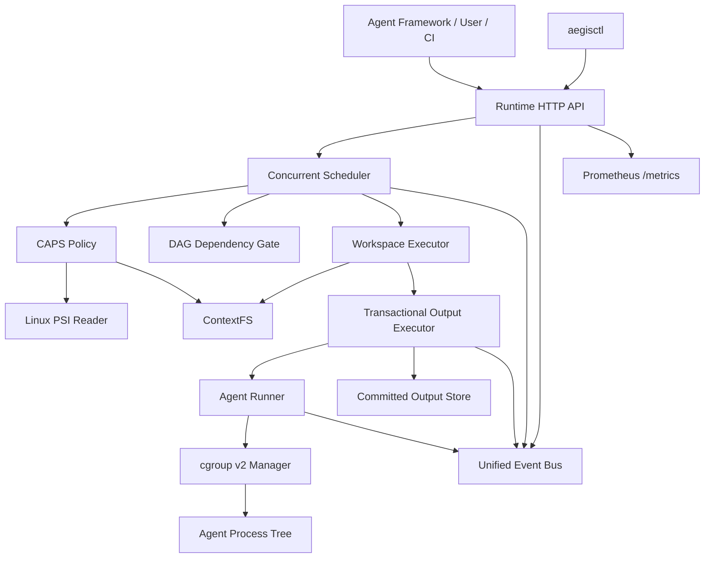

# AegisRT

> 面向多智能体系统的 AI-Native Agent Runtime  
> **统一调度、资源隔离、上下文复用、事务输出、DAG 故障传播与系统级可观测性**

AegisRT 是一个运行在 Linux 用户态的多 Agent 执行时。它不只是对 Agent 工作流进行编排，而是将 **Agent 作为系统级一等执行实体**，统一管理其生命周期、资源预算、上下文数据、依赖关系、输出提交和运行时状态。

AegisRT 以 openEuler 和 Linux 内核能力为基础，结合 cgroup v2、PSI、内容寻址存储和事务化输出机制，为多 Agent 系统提供可调度、可隔离、可复用、可验证和可观测的运行环境。

当前版本：**v0.1.0**

---

## 目录

- [项目背景](#项目背景)
- [核心能力](#核心能力)
- [系统架构](#系统架构)
- [核心设计](#核心设计)
- [项目结构](#项目结构)
- [运行环境](#运行环境)
- [快速开始](#快速开始)
- [启用 cgroup v2 与 PSI](#启用-cgroup-v2-与-psi)
- [运行演示](#运行演示)
- [Runtime HTTP API](#runtime-http-api)
- [aegisctl CLI](#aegisctl-cli)
- [Prometheus 指标](#prometheus-指标)
- [测试与质量检查](#测试与质量检查)
- [关键安全与一致性约束](#关键安全与一致性约束)
- [当前完成状态](#当前完成状态)
- [已知限制](#已知限制)
- [后续计划](#后续计划)
- [许可证](#许可证)

---

## 项目背景

传统多 Agent 框架通常关注：

- Agent 间消息流和工作流编排；
- LLM、工具和 Prompt 的调用；
- DAG、Chain、Graph 等上层抽象。

但在多个 Agent 并发运行时，仍然存在一系列系统级问题：

1. 不同 Agent 争用 CPU、内存和 I/O，缺少统一资源治理；
2. Agent 进程及其子进程可能失控，故障难以隔离；
3. 相同上下文被重复加载和复制，产生大量内存与存储冗余；
4. 上游任务失败后，下游仍可能读取不完整结果；
5. Agent 输出直接写入共享目录，容易暴露半成品；
6. 调度决策、内核压力、资源使用和数据依赖缺少统一观测；
7. Runtime 缺少可查询、可控制、可复盘的系统级接口。

AegisRT 的目标是补齐这一层：

```text
Agent Framework / LLM Application
                │
                ▼
             AegisRT
                │
                ▼
Linux cgroup v2 / PSI / Filesystem / Process
```

它位于上层 Agent 框架与 Linux 操作系统之间，为 Agent 提供统一运行时服务。

---

## 核心能力

### 1. Agent 生命周期与 ACB

AegisRT 使用 Agent Control Block（ACB）描述一个 Agent 的完整运行状态，包括：

- Agent ID、角色、命令和参数；
- 生命周期状态；
- CPU、内存、PID 等资源预算；
- ContextFS 上下文引用；
- 工作区与环境变量；
- DAG 依赖输出；
- 事务输出状态；
- cgroup 路径与资源统计；
- 错误、退出码与执行结果。

典型生命周期：

```text
CREATED → READY → RUNNING → SUCCEEDED
                         └→ FAILED
```

在调度层还包括：

```text
QUEUED → RUNNING → SUCCEEDED
                 ├→ FAILED
                 └→ BLOCKED
```

### 2. cgroup v2 故障域

每个 Agent 进入独立 cgroup，并可设置：

- CPU quota；
- `memory.max`；
- `memory.swap.max`；
- `pids.max`；
- CPU、内存和 OOM 统计。

当 Agent 超时、OOM 或产生失控子进程时，Runtime 可以通过 `cgroup.kill` 清理整个进程树，而不是只终止父进程。

```text
Agent
├── main process
├── child process
└── grandchild process

全部位于同一个 Agent cgroup
```

这使每个 Agent 成为独立的故障域。

### 3. CAPS 压力感知调度

AegisRT 实现了 CAPS（Context-Affinity and Pressure-aware Scheduling）策略。

CAPS 综合考虑：

- Linux PSI CPU 压力；
- Linux PSI 内存压力；
- Linux PSI I/O 压力；
- Agent 的资源需求；
- Agent 的排队等待时间；
- 所需上下文的可复用比例；
- 可复用上下文字节数。

简化后的调度思想：

```text
score =
    resource pressure penalty
  - context affinity benefit
  - waiting age bonus
```

与纯 FIFO 相比，CAPS 可以：

- 在系统压力较高时减少高开销任务抢占；
- 优先运行可复用热上下文的 Agent；
- 通过等待时间奖励避免长期饥饿；
- 在资源压力和上下文命中之间进行动态权衡。

### 4. ContextFS 内容寻址存储

ContextFS 使用 SHA-256 作为不可变对象标识：

```text
logical reference
        │
        ▼
SHA-256 digest
        │
        ▼
immutable Blob
```

主要能力：

- 内容寻址；
- 相同内容物理去重；
- 原子 Blob 发布；
- 逻辑引用绑定；
- 引用扫描；
- 垃圾回收；
- 并发写入安全；
- 元数据持久化。

目录结构示例：

```text
contextfs/
├── blobs/
│   └── sha256/
├── metadata/
│   └── sha256/
├── refs/
└── tmp/
```

两个不同逻辑名称只要指向相同 Digest，就会被识别为同一个上下文对象。

### 5. Agent 隔离工作区

ContextFS 对象不会直接暴露给 Agent 修改。Runtime 会为每个 Agent 创建独立工作区：

```text
workspace/
├── inputs/      # 只读上下文
├── private/     # Agent 私有可写副本
└── manifest.json
```

物化策略：

1. 优先尝试 Linux `FICLONE` reflink；
2. 文件系统不支持 reflink 时自动退化为普通复制；
3. 不使用可污染原始 Blob 的硬链接；
4. 工作区先在临时目录构建；
5. 全部完成后通过原子 rename 发布。

因此：

- Agent 私有修改不会污染 ContextFS Blob；
- 不同 Agent 之间的修改相互隔离；
- 可以按策略清理成功工作区；
- 可以保留失败工作区用于调试。

### 6. 事务化 Agent 输出

Agent 不直接向共享结果目录写入数据，而是写入私有 staging：

```text
Agent
  │
  ▼
output staging
  │
  ├── process failed      → discard / retain
  ├── validation failed   → discard / retain
  └── validation passed
            │
            ▼
       atomic rename
            │
            ▼
     committed output
```

提交前会检查：

- 输出文件数量；
- 输出总字节数；
- 文件是否为普通文件；
- 是否存在符号链接；
- 是否存在设备文件等特殊对象；
- 文件 SHA-256；
- 文件权限；
- 输出 Manifest。

成功提交后：

- staging 目录消失；
- committed 目录原子出现；
- 输出文件变为只读；
- 生成 `.aegis-commit.json`；
- Runtime 记录事务 ID、文件数和总字节数。

### 7. DAG 依赖与故障传播

Job 可以声明：

```go
DependsOn: []string{
    "producer-agent",
}
```

下游 Agent 只有在上游满足以下条件时才会运行：

```text
Phase == SUCCEEDED
OutputCommitted == true
OutputVerified == true
```

如果上游执行失败、没有提交输出、Manifest 非法、SHA-256 不一致或输出被篡改，则下游进入：

```text
BLOCKED
```

更深层依赖会继续传播为 BLOCKED。

BLOCKED Agent 不会创建：

- Agent 进程；
- cgroup；
- 工作区；
- 输出事务。

### 8. 已提交输出完整性验证

在将上游输出交给下游之前，AegisRT 会重新读取提交 Manifest 并验证：

- Agent ID；
- Transaction ID；
- Commit Path；
- Manifest Path；
- 文件数量；
- 文件总大小；
- 文件权限；
- 每个文件的 SHA-256；
- 是否存在未写入 Manifest 的额外文件；
- 路径中是否存在符号链接；
- 路径是否逃逸 Agent 命名空间。

验证成功后产生：

```text
OutputVerified = true
VerificationMethod = "sha256-manifest"
```

### 9. 统一事件流

AegisRT 将关键运行时行为统一为结构化事件：

```text
runtime.agent.submitted
runtime.pressure.sampled
runtime.agent.dispatched
runtime.agent.blocked
runtime.output.committed
runtime.output.verified
runtime.output.verification_failed
runtime.agent.finished
```

每个事件包含：

- 全局连续 Sequence；
- 唯一 Event ID；
- UTC 时间戳；
- Agent ID；
- Agent Phase；
- 事件类型；
- 不可变 JSON Payload。

事件同时进入：

- 有界内存存储；
- JSONL 持久化日志。

后续 API 和 CLI 都基于统一事件流工作。

### 10. HTTP API、Prometheus 与 CLI

AegisRT 提供只读 Runtime 查询接口：

```text
GET /healthz
GET /readyz
GET /metrics
GET /v1/runtime/status
GET /v1/agents
GET /v1/agents/{id}
GET /v1/events
```

并提供 `aegisctl`：

```text
aegisctl health
aegisctl ready
aegisctl status
aegisctl agents
aegisctl agent
aegisctl events
aegisctl watch
aegisctl metrics
```

---

## 系统架构



执行链：

```text
Submit Job
    │
    ▼
Resolve ContextFS references
    │
    ▼
DAG dependency gate
    │
    ▼
CAPS selects ready Agent
    │
    ▼
Create Agent workspace
    │
    ▼
Begin output transaction
    │
    ▼
Create and attach cgroup
    │
    ▼
Run Agent process tree
    │
    ▼
Validate and commit output
    │
    ▼
Verify SHA-256 Manifest
    │
    ▼
Publish events and wake downstream DAG nodes
```

---

## 核心设计

### Agent 是一等执行实体

AegisRT 不将 Agent 简单视为一个函数调用。每个 Agent 都拥有独立身份、生命周期、资源预算、cgroup、工作区、上下文集合、DAG 依赖、输出事务与可观测记录。

### 内容身份与逻辑名称分离

```text
agent://dataset/shared
agent://model/context
agent://task/input
```

这些逻辑名称可以指向同一个 SHA-256 对象。调度器使用 Digest 计算真实上下文亲和度，而不是只比较逻辑名称。

### 进程成功不等于任务成功

在 AegisRT 中，`exit code == 0` 只代表 Agent 进程正常退出，不代表任务结果有效。任务成功还需要：

```text
output validation passed
output committed atomically
output integrity verified
```

### 依赖结果必须是已验证结果

下游不会直接读取上游 staging 或临时文件，只接收：

```text
committed + verified
```

的输出引用。

---

## 项目结构

```text
aegisrt/
├── cmd/
│   ├── aegisd/                 # 基础 Runtime daemon
│   ├── aegisctl/               # Runtime CLI
│   ├── apidemo/                # HTTP API 综合演示
│   ├── eventdemo/              # 统一事件流演示
│   ├── integritydagdemo/       # DAG 完整性验证演示
│   ├── transactiondemo/        # 事务输出演示
│   ├── workspaceexecdemo/      # 工作区执行链演示
│   ├── contextbridgedemo/      # ContextFS 与 Scheduler 桥接演示
│   ├── contextfsdemo/          # ContextFS 基础演示
│   ├── affinitydemo/           # 上下文亲和调度演示
│   ├── capsdemo/               # CAPS 调度演示
│   └── psidemo/                # PSI 采样演示
│
├── internal/
│   ├── agent/                  # ACB 与 Agent 数据模型
│   ├── scheduler/              # 并发 Scheduler、FIFO、CAPS、DAG
│   ├── runtime/                # Runner 与执行包装器
│   ├── resource/               # cgroup v2 管理
│   ├── pressure/               # Linux PSI 读取
│   ├── contextfs/              # 内容寻址存储与工作区
│   ├── contextstore/           # 上下文解析和热上下文注册
│   ├── outputtxn/              # 事务输出和完整性验证
│   ├── telemetry/              # 统一事件总线
│   ├── controlapi/             # HTTP 查询 API 与指标
│   └── controlclient/          # aegisctl HTTP Client
│
├── worker/
│   └── python/                 # 测试和演示 Agent
├── deploy/
│   └── systemd/                # systemd Demo Units
├── logs/                       # 本地演示日志
├── var/                        # Runtime 演示数据
├── bin/                        # 本地构建产物
├── go.mod
└── README.md
```

具体目录可能随版本迭代略有调整。

---

## 运行环境

| 组件 | 推荐版本 |
|---|---|
| 操作系统 | openEuler 24.03 LTS SP4 |
| Linux Kernel | 6.6 或更高 |
| Go | 1.23 或更高 |
| Python | 3.9 或更高 |
| cgroup | cgroup v2 |
| PSI | CPU、Memory、I/O PSI 可用 |
| init system | systemd |

AegisRT 也可以在其他支持 cgroup v2 和 PSI 的 Linux 发行版上运行。

---

## 快速开始

### 1. 克隆仓库

```bash
git clone git@github.com:OrenoHikari/aegisrt.git
cd aegisrt
```

### 2. 检查环境

```bash
go version
python3 --version
```

### 3. 格式化、测试和构建

```bash
gofmt -w internal cmd
go test ./...
go vet ./...
go build ./cmd/...
```

完整竞态检查：

```bash
go test -race ./...
```

### 4. 构建主要二进制

```bash
mkdir -p bin

go build -o bin/aegisd ./cmd/aegisd
go build -o bin/apidemo ./cmd/apidemo
go build -o bin/aegisctl ./cmd/aegisctl
```

### 5. 本地无 cgroup 模式启动 API Demo

```bash
./bin/apidemo   -disable-cgroup   -listen 127.0.0.1:18080   -shutdown-after 60s
```

另开一个终端：

```bash
./bin/aegisctl status
./bin/aegisctl agents
./bin/aegisctl events
./bin/aegisctl metrics
```

---

## 启用 cgroup v2 与 PSI

### 检查 cgroup v2

```bash
stat -fc %T /sys/fs/cgroup
```

预期：

```text
cgroup2fs
```

查看控制器：

```bash
cat /sys/fs/cgroup/cgroup.controllers
```

预期至少包含：

```text
cpu memory pids
```

### 检查 PSI

```bash
cat /proc/pressure/cpu
cat /proc/pressure/memory
cat /proc/pressure/io
```

### 检查内核启动参数

```bash
cat /proc/cmdline
```

系统未启用纯 cgroup v2 和 PSI 时，可根据发行版配置：

```text
cgroup_no_v1=all psi=1
```

修改 GRUB 前请先确认系统启动方式和发行版文档。

### systemd Delegation

AegisRT 服务需要：

```ini
Delegate=cpu memory pids
CPUAccounting=yes
MemoryAccounting=yes
TasksAccounting=yes
```

---

## 运行演示

```bash
go run ./cmd/psidemo
go run ./cmd/capsdemo
go run ./cmd/affinitydemo
go run ./cmd/contextfsdemo
go run ./cmd/contextbridgedemo -disable-cgroup
go run ./cmd/workspacedemo
go run ./cmd/workspaceexecdemo -disable-cgroup
go run ./cmd/transactiondemo -disable-cgroup
go run ./cmd/integritydagdemo -disable-cgroup
go run ./cmd/eventdemo -disable-cgroup
```

启动 Runtime API：

```bash
go run ./cmd/apidemo   -disable-cgroup   -listen 127.0.0.1:18080
```

---

## Runtime HTTP API

默认地址：

```text
http://127.0.0.1:18080
```

| 方法 | 路径 | 说明 |
|---|---|---|
| GET | `/healthz` | 进程存活检查 |
| GET | `/readyz` | Runtime 就绪检查 |
| GET | `/metrics` | Prometheus 指标 |
| GET | `/v1/runtime/status` | Runtime 状态 |
| GET | `/v1/agents` | Agent 列表 |
| GET | `/v1/agents/{id}` | 单个 Agent |
| GET | `/v1/events` | Runtime 事件 |

Agent 查询参数：

| 参数 | 说明 |
|---|---|
| `phase` | 按 QUEUED、RUNNING、SUCCEEDED、FAILED、BLOCKED 过滤 |
| `limit` | 返回记录数量，最大 1000 |

事件查询参数：

| 参数 | 说明 |
|---|---|
| `since` | 只返回 Sequence 大于该值的事件 |
| `limit` | 最大事件数 |
| `kind` | 按事件类型过滤 |
| `agent_id` | 按 Agent ID 过滤 |
| `phase` | 按 Agent Phase 过滤 |

示例：

```bash
curl -sS http://127.0.0.1:18080/healthz   | python3 -m json.tool

curl -sS   'http://127.0.0.1:18080/v1/agents?phase=FAILED&limit=100'   | python3 -m json.tool

curl -sS   'http://127.0.0.1:18080/v1/events?since=10&limit=100'   | python3 -m json.tool
```

---

## aegisctl CLI

### 构建和安装

```bash
go build -o bin/aegisctl ./cmd/aegisctl

sudo install   -o root   -g root   -m 0755   bin/aegisctl   /usr/local/bin/aegisctl
```

### 常用命令

```bash
aegisctl help
aegisctl health
aegisctl ready
aegisctl status

aegisctl agents
aegisctl agents -phase SUCCEEDED
aegisctl agents -phase FAILED
aegisctl agents -phase BLOCKED

aegisctl agent api-producer-success

aegisctl events
aegisctl events -since 10
aegisctl events -kind runtime.agent.finished
aegisctl events -agent-id api-producer-success

aegisctl watch
aegisctl watch -agent-id api-producer-success
aegisctl watch -json

aegisctl metrics
```

指定 Runtime 地址：

```bash
export AEGISRT_SERVER=http://127.0.0.1:18080
aegisctl status
```

或者：

```bash
aegisctl   -server http://127.0.0.1:18080   status
```

---

## Prometheus 指标

接口：

```http
GET /metrics
```

主要指标：

| 指标 | 说明 |
|---|---|
| `aegisrt_up` | HTTP Runtime 进程是否存活 |
| `aegisrt_ready` | Runtime 是否就绪 |
| `aegisrt_runtime_uptime_seconds` | API 运行时长 |
| `aegisrt_scheduler_started` | Scheduler 是否启动 |
| `aegisrt_scheduler_stopped` | Scheduler 是否停止 |
| `aegisrt_scheduler_workers` | Worker 数量 |
| `aegisrt_scheduler_queue_depth` | 当前队列长度 |
| `aegisrt_scheduler_queue_capacity` | 队列容量 |
| `aegisrt_scheduler_agents{phase=...}` | 各状态 Agent 数量 |
| `aegisrt_event_bus_published_total` | 已发布事件总数 |
| `aegisrt_event_bus_delivered_total` | 已投递事件总数 |
| `aegisrt_event_bus_sink_errors_total` | Event Sink 错误数 |
| `aegisrt_event_bus_queue_depth` | 事件队列长度 |
| `aegisrt_event_sequence` | 最新事件序列号 |

Prometheus 配置示例：

```yaml
scrape_configs:
  - job_name: aegisrt
    static_configs:
      - targets:
          - 127.0.0.1:18080
```

---

## 测试与质量检查

发布前建议执行：

```bash
gofmt -w internal cmd
go test ./...
go test -race ./...
go vet ./...
go build ./cmd/...
python3 -m py_compile worker/python/*.py
```

单项命令：

```bash
go test ./...
go test -race ./...
go vet ./...
go build ./cmd/...
```

---

## 关键安全与一致性约束

1. ContextFS Blob 发布后不可变；
2. 相同内容只保留一个物理 Blob；
3. Agent 私有写入不直接修改共享 Blob；
4. 每个 Agent 使用独立 cgroup；
5. 超时可终止 Agent 整个进程树；
6. OOM 由 Agent cgroup 限制和记录；
7. 输出必须先进入私有 staging；
8. 失败任务不会产生 committed 结果；
9. 符号链接和非普通输出文件会被拒绝；
10. committed 输出默认只读；
11. 下游只能消费 verified 输出；
12. 上游失败会阻塞依赖任务；
13. BLOCKED Agent 不产生执行副作用；
14. HTTP 控制面当前只提供只读 GET；
15. API 默认仅监听 `127.0.0.1`；
16. 所有关键状态变化都会进入统一事件流。

---

## 当前完成状态

- [x] Agent Control Block 与生命周期；
- [x] Python Agent Runner；
- [x] cgroup v2 CPU、内存和 PID 隔离；
- [x] OOM 检测和进程树清理；
- [x] 并发 Scheduler 与有界队列；
- [x] FIFO 与 CAPS Policy；
- [x] Linux PSI Reader；
- [x] Context affinity 调度；
- [x] ContextFS 内容寻址与 SHA-256 去重；
- [x] ContextFS 逻辑引用和垃圾回收；
- [x] Agent 隔离工作区；
- [x] reflink / copy fallback；
- [x] 事务输出和原子提交；
- [x] 输出 Manifest；
- [x] DAG 依赖门控；
- [x] BLOCKED 故障传播；
- [x] 已提交输出 SHA-256 验证；
- [x] 统一 Runtime 事件流；
- [x] JSONL 事件持久化；
- [x] Runtime HTTP API；
- [x] 健康与就绪检查；
- [x] Prometheus 指标；
- [x] `aegisctl` CLI。

---

## 已知限制

当前 v0.1.0 主要面向单机多 Agent Runtime：

1. 尚未实现跨节点分布式调度；
2. 尚未实现 Runtime API 身份认证和授权；
3. HTTP 控制面当前以只读查询为主；
4. ContextFS GC 仍以单机本地存储为基础；
5. 热上下文状态主要由 Runtime 内存维护；
6. 尚未直接接入 vLLM Prefix Cache 或 KV Cache；
7. 尚未提供生产级 Web Dashboard；
8. 尚未完成大规模真实 LLM Agent 基准；
9. systemd Demo Unit 中的用户和路径需要按部署环境调整；
10. 当前版本更适合作为研究原型和比赛系统，而不是直接作为生产集群平台。

---

## 后续计划

后续工作聚焦于模型接入、性能验证和工程化：

- vLLM 与 OpenAI-compatible inference server；
- Prefix Cache / KV Cache 感知调度；
- GPU 显存和拓扑感知；
- ContextFS 热、温、冷分层；
- 多节点 Runtime；
- OpenTelemetry、Grafana 和 Jaeger；
- Web Dashboard 与 DAG 可视化；
- FIFO 与 CAPS 完成时间对比；
- Context 命中率和物理去重率；
- PSI 高压环境下的尾延迟；
- OOM、进程泄漏和输出篡改故障注入。

---

## 适合展示的核心演示

比赛或答辩中建议按以下顺序展示：

1. 同时提交多个 Agent；
2. CAPS 读取 PSI 并做出调度选择；
3. 两个逻辑上下文解析为同一个 ContextFS Digest；
4. 展示 ContextFS 物理去重；
5. 展示每个 Agent 的独立 cgroup；
6. 展示 Agent 私有工作区；
7. 展示 Agent 私有修改不污染共享 Blob；
8. 展示成功输出原子提交；
9. 篡改上游输出并触发 SHA-256 验证失败；
10. 展示下游 Agent 自动进入 BLOCKED；
11. 使用 `aegisctl` 查询完整状态；
12. 使用 `/metrics` 展示 Runtime 指标；
13. 使用 `aegisctl watch` 展示统一事件时间线。

---

## 项目定位

AegisRT 不是 Prompt 管理工具、简单工作流框架、单纯的 DAG Executor，也不是对某个 Agent 框架的轻量封装。

AegisRT 的定位是：

> 面向多 Agent 系统的用户态执行时，通过 Linux 内核资源治理、压力感知调度、内容寻址上下文、事务输出和系统级可观测性，为 Agent 提供统一的运行环境。

---

## 许可证

当前仓库主要用于研究、比赛和原型验证。

在公开发布或允许第三方使用前，请在仓库根目录添加明确的 `LICENSE` 文件，并根据项目需要选择 Apache-2.0、MIT 或其他许可证。

---

## 致谢

AegisRT 的实现依赖和受益于：

- openEuler；
- Linux cgroup v2；
- Linux Pressure Stall Information；
- systemd resource delegation；
- Go concurrency runtime；
- SHA-256 content-addressed storage design；
- Prometheus exposition format。

---

<p align="center">
  <b>AegisRT — Make Agents First-Class Runtime Citizens.</b>
</p>
